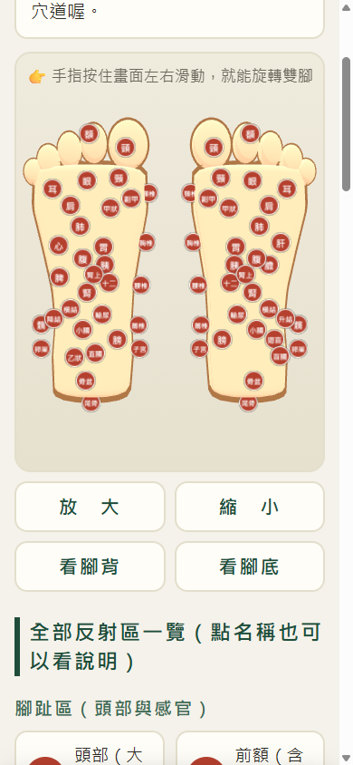
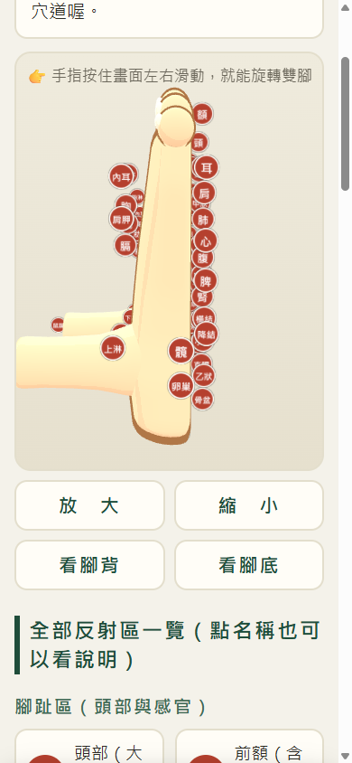

# 🦶 腳底按摩 3D 穴道對照

給家中長輩做的腳底按摩小工具：**卡通 3D 雙腳可以用手指旋轉**，按摩時哪裡痠痛，點那個紅點就跳出大字說明——這是什麼反射區、對應身體哪個器官、飲食怎麼調整、做什麼運動改善。

**👉 線上體驗（免安裝、免登入）：https://foot-massage-map.pages.dev**

| 腳底視角 | 側面（含腳踝） |
|:---:|:---:|
|  |  |

## 功能特色

- **47 個反射區**：腳底 30、腳背 9、腳內外側與腳踝 8，依衛福部「民俗調理腳底按摩操作參考手冊」反射區圖整理
- **卡通 3D 雙腳**：斷面放樣建模（不是現成模型）——腳跟高圓、足弓收腰、腳背坡度、半截小腿，配卡通描邊與三階色調上色
- **單指旋轉＋大按鈕**：放大／縮小／看腳背／看腳底，為長輩設計的操作方式
- **大字說明視窗**：每個反射區含「這是什麼、痠痛可能代表、飲食建議、運動與生活建議」四段說明，內文 21px 起跳
- **按摩小叮嚀**：最佳時機、頻率、力道，與六種不適合按摩的族群提醒
- **針對 iPhone 直向優化**：可用 Safari「加入主畫面」變成一顆 App 圖示
- **不支援 WebGL 的舊手機**自動改用文字清單，功能不減

## 技術重點

- 單一 `index.html`，無需 build、無框架，任何靜態空間都能放
- Three.js（CDN 載入）：
  - 腳掌與小腿皆以**斷面放樣（loft）**程式化建模，關鍵斷面參數可調
  - 卡通渲染：`MeshToonMaterial` 三階 gradientMap ＋ 反面外殼（inverted hull）描邊
  - 穴道紅點用 `Sprite`（永遠面向鏡頭），raycast 點擊、與拖曳旋轉手勢共存
- 反射區資料集中在一個 `POINTS` 陣列，一筆一個反射區，方便增修

## 自行部署

不需要任何後端，把 `index.html` 放上任何靜態空間即可。以 Cloudflare Pages 為例：

```bash
wrangler pages deploy foot-massage-map --project-name=<你的專案名> --branch=main
```

## 資料來源與免責聲明

反射區位置與對應器官整理自衛福部「民俗調理腳底按摩操作參考手冊」（經[良醫健康網文章](https://health.businessweekly.com.tw/article/ARTL003012909)彙整）。本工具僅為一般保健參考，反射區痠痛不代表生病；持續不適請就醫。

## License

MIT
