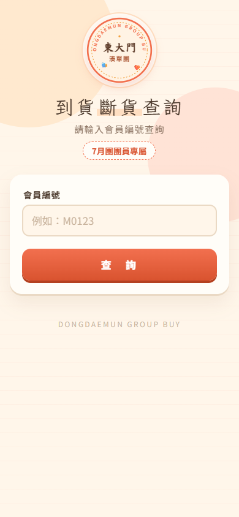
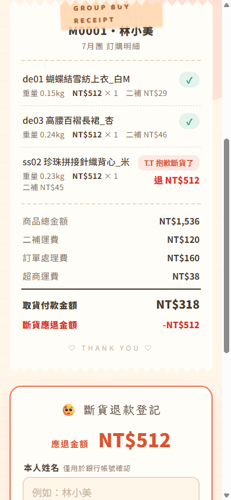
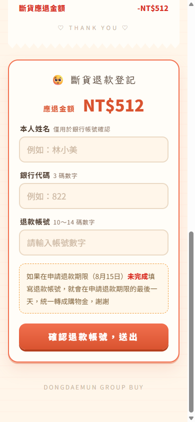
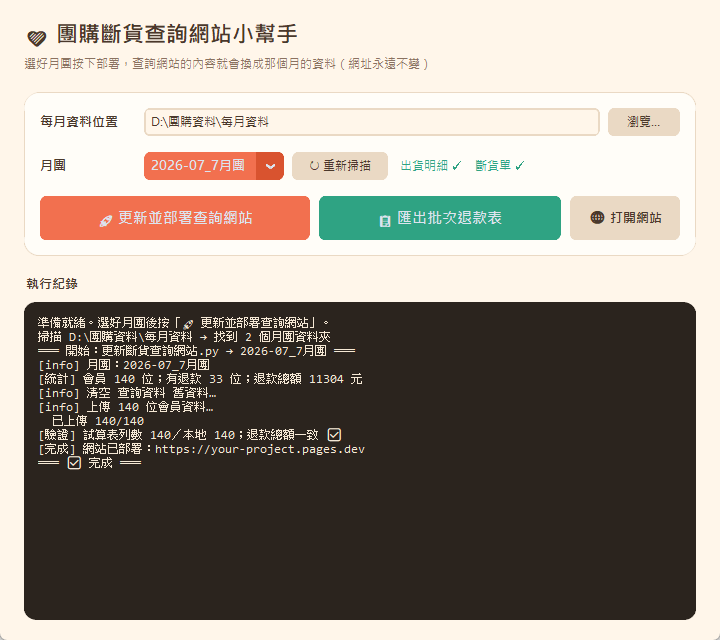

# 🧡 groupbuy-refund-checker — 團購斷貨退款查詢系統

> 團購結單後最煩的客服工作：「我的東西斷貨了嗎？要退我多少？」「退款帳號傳給你囉」——
> 這套系統讓團員**自己上網查、自己填帳號**，主理人一鍵匯出批次退款表，整條退款流程不再靠私訊往返。
> 為一個實際營運中的韓貨團購（東大門湊單團）打造，每月服務上百位團員。

| 手機查詢頁 | 查詢結果（收據風格） | 退款登記 |
|---|---|---|
|  |  |  |

*（截圖中的會員與品項皆為展示用假資料）*

## 它解決什麼問題

團購到貨常有「斷貨」（韓國檔口缺貨），主理人要退錢給幾十位團員。傳統做法：一個一個私訊通知金額、等回覆帳號、抄進 Excel——容易漏、容易錯、很花時間。

這套系統把流程變成：

1. 主理人打開**桌面小幫手**（下圖），選好月份、按「🚀 更新並部署」
2. 系統讀取出貨明細與斷貨單 Excel → 整理每位團員的訂購、斷貨、應退金額 → 上傳 Google 試算表 → 部署查詢網站（**網址永遠不變**，只換內容）
3. 團員輸入會員編號，看到自己的「收據」：買了什麼、哪件斷貨、退多少；有退款的當場填銀行帳號（10~14 碼防呆）
4. 主理人按「📋 匯出批次退款表」：已填帳號的直接帶入、沒填的標紅字，一張表完成批次轉帳



## 設計重點

- **零資安暴露**：網站本體只有 3 個靜態檔案，不內含任何會員資料；查詢經 Google Apps Script 在伺服器端比對後只回傳該會員自己的資料。銀行帳號只存在主理人私人的 Google 試算表。
- **資料流單向、來源唯一**：金額永遠以生意現場的 Excel（出貨明細／斷貨單）為準，網站不自己算帳；每月更新是「全量重灌」，不會有殘留舊資料。
- **防呆**：會員編號模糊輸入（`m45` 也查得到 `M0045`）、台灣銀行帳號 10~14 碼前後端雙重驗證、重複送出自動以最新一筆為準（舊資料標「已覆蓋」）。
- **免費架構**：Cloudflare Pages（靜態託管）＋ Google Apps Script／試算表（後端與資料庫），全程 $0。

## 架構

```
出貨明細.xlsx ─┐
斷貨單.xlsx   ─┼─▶ 更新斷貨查詢網站.py ─▶ Google 試算表（查詢資料）
入庫單.xlsx   ─┘         │
                         └─▶ wrangler ─▶ Cloudflare Pages（靜態網站）
                                              │
團員手機 ──▶ 網站 ──▶ Apps Script(doPost) ──▶ 試算表（比對＋寫入退款帳號回覆）
                                              │
主理人 ◀── 批次退款表.xlsx ◀── 匯出批次退款表.py ◀──┘
```

| 檔案 | 用途 |
|---|---|
| `斷貨查詢小幫手.py` | CustomTkinter 桌面 UI：掃描月份資料夾、一鍵部署／匯出 |
| `更新斷貨查詢網站.py` | 解析 Excel → 上傳試算表 → 部署網站（含上傳後讀回驗證） |
| `匯出批次退款表.py` | 合併「應退名單 × 已填帳號」→ Excel＋試算表分頁 |
| `apps_script/Code.gs` | 後端：查詢比對、退款帳號寫入（LockService 防併發） |
| `網站/index.html` | 手機優先單檔前端（收據風格 UI，無框架） |

技術備忘：Windows 上大量資料走 CLI 時，`.cmd` 包裝檔經 cmd.exe 有 8191 字元上限，改用 node 直呼底層腳本把上限提高到 32767；Apps Script 跨網域用 `text/plain` POST 避開 preflight。

---

## 給 AI 的安裝指南

> 使用者把這個 repo 交給你安裝時，照以下流程逐步進行。每完成一步再走下一步，
> 需要使用者授權（Google／Cloudflare 登入）時明確告訴他要按什麼。

**前置需求**：Python 3.10+（`openpyxl`、`customtkinter`、`Pillow`）、Node.js 18+、
[`@googleworkspace/cli`](https://www.npmjs.com/package/@googleworkspace/cli)（`gws auth login` 完成授權）、
`wrangler`（`wrangler login`）、`@google/clasp`（`clasp login`，並到 script.google.com/home/usersettings 開啟 Apps Script API）。

1. **建 Google 試算表**：建立試算表（名稱自訂），三個分頁：
   - `設定`：A1:B4 填 `項目/值`、`月團名稱/(留空)`、`退款期限/(日期)`、`開放查詢/是`
   - `查詢資料`：表頭 `會員編號 姓名 總金額 二補運費加總 品項數 斷貨品項數 應退金額 明細JSON`
   - `退款帳號回覆`：表頭 `送出時間 會員編號 姓名 應退金額 銀行代碼 帳號 狀態`
2. **部署 Apps Script**：把 `apps_script/Code.gs` 第一行 `SS_ID` 換成試算表 ID →
   在 `apps_script/` 目錄 `clasp create-script --title "斷貨查詢服務" --type standalone` →
   把本 repo 的 `appsscript.json` 蓋回去（clasp create 會覆寫它）→ `clasp push -f` →
   `clasp deploy`。請使用者在 Apps Script 編輯器跑一次 `getConf` 完成授權（審查權限 → 允許）。
   之後改程式碼一律 `clasp push -f` ＋ `clasp update-deployment <部署ID>`，網址才不會變。
3. **建 Cloudflare Pages 專案**：`wrangler pages project create <專案名> --production-branch main`
4. **填設定檔**：複製 `設定.json.example` → `設定.json`，填入試算表 ID、Apps Script `/exec` 網址、Pages 專案名。
5. **準備資料**：使用者的每月資料夾結構為 `每月資料/{YYYY-MM}_{N}月團/出貨單/*出貨明細*.xlsx` 與 `斷貨單/*斷貨單*.xlsx`。
   欄位格式與這套團購流程綁定（見 `更新斷貨查詢網站.py` 開頭註解）；別的格式需要先訪談使用者欄位對應再改 `read_shipping_detail()`／`read_shortage()`。
6. **驗收**：`python 斷貨查詢小幫手.py` → 選月份 → 「🚀 更新並部署」→ 用一位真實會員編號在手機查詢，
   核對金額與 Excel 一致；填一筆測試帳號，確認試算表「退款帳號回覆」收到後把該列刪掉。

## License

MIT
